[linkedin](https://www.linkedin.com/in/pratik-r1104/) &nbsp;·&nbsp;
[twitter](https://x.com/mrpratik753) &nbsp;·&nbsp;
[instagram](https://www.instagram.com/dev.prat1k/) &nbsp;·&nbsp;
[leetcode](https://leetcode.com/prateekraiger) &nbsp;·&nbsp;
[email](mailto:prateekraiger098@gmail.com)

> Full-Stack & UI/UX Developer building high-performance web applications. 
> Clean code, thoughtful design, and relentless iteration.

I build fast, responsive applications and explore modern web technologies. 
Currently engineering **[Sakuga_UI](https://github.com/prateekraiger/sakuga-ui)** — a modern component library built 
for speed and fluid user experiences. Deepening expertise in **Next.js**, **TypeScript**, 
**Java**, and scalable full-stack architecture.

<samp>cpp &nbsp; java &nbsp; python &nbsp; html &nbsp; css &nbsp; tailwind &nbsp; javascript &nbsp; typescript &nbsp; react &nbsp; next.js &nbsp; express &nbsp; mongodb &nbsp; mysql &nbsp; git &nbsp; github</samp>

**[Sakuga_UI](https://github.com/prateekraiger/sakuga-ui)** &nbsp;·&nbsp; <samp>react, typescript, tailwind</samp> 
A sleek, modern component library built for rapid UI creation, 
smooth micro-animations, and seamless developer experience.

**[Voyazo Travel Website](https://github.com/prateekraiger/Voyazo-Travel-Website)** &nbsp;·&nbsp; <samp>javascript, html, css</samp> 
Feature-packed travel platform featuring responsive design, 
interactive destination showcases, and modern frontend architecture.

&nbsp;&nbsp;&nbsp;&nbsp;

&nbsp;&nbsp;&nbsp;&nbsp;

&nbsp;&nbsp;&nbsp;&nbsp;

&nbsp;&nbsp;&nbsp;&nbsp;

Every graphic here is generated directly inside this repository, with zero third-party 
server requests or external widgets. `ascii.svg` is an animated self-typing 
character matrix; section headings and data stats are rendered by 
[a scheduled GitHub Action](.github/workflows/stats.yml) querying the GitHub GraphQL API daily.

Animations use native SMIL embedded inside SVGs with base64 inlined [JetBrains Mono](scripts/fonts) 
typography. This guarantees zero rate limits, no third-party uptime dependency, 
and consistent pixel-perfect typography across all devices.
