  

  

[linkedin](https://www.linkedin.com/in/pratik-r1104/) &nbsp;·&nbsp;
[twitter](https://x.com/mrpratik753) &nbsp;·&nbsp;
[instagram](https://www.instagram.com/dev.prat1k/) &nbsp;·&nbsp;
[leetcode](https://leetcode.com/prateekraiger)

> Full-Stack & UI/UX Developer building high-performance web applications. 
> Clean code, thoughtful design, and relentless iteration.

I build fast, responsive applications and explore modern web technologies. 
Currently engineering full-stack applications with **TypeScript**, **Next.js**, 
**React**, and scalable cloud architectures.

<samp>cpp &nbsp; java &nbsp; python &nbsp; html &nbsp; css &nbsp; tailwind &nbsp; javascript &nbsp; typescript &nbsp; react &nbsp; next.js &nbsp; express &nbsp; mongodb &nbsp; mysql &nbsp; git &nbsp; github</samp>

**[royal-plaza](https://github.com/prateekraiger/royal-plaza)** &nbsp;·&nbsp; <samp>typescript, react</samp> 
Don't just visit. Dwell. Modern hospitality & luxury reservation web application.

**[button-ui](https://github.com/prateekraiger/button-ui)** &nbsp;·&nbsp; <samp>typescript, react</samp> 
Interactive, highly customizable component UI library designed for fluid user experiences.

**[BioCraft](https://github.com/prateekraiger/BioCraft)** &nbsp;·&nbsp; <samp>typescript, next.js</samp> 
Developer portfolio & bio showcase platform built for modern creators.

**[buildmeCV](https://github.com/prateekraiger/buildmeCV)** &nbsp;·&nbsp; <samp>typescript, react</samp> 
Instant resume & CV generator tool tailored for software engineers.

**[Riya](https://github.com/prateekraiger/Riya)** &nbsp;·&nbsp; <samp>typescript</samp> 
Feature-packed full-stack web application with responsive UI.

  

  

  

&nbsp;&nbsp;

&nbsp;&nbsp;

&nbsp;&nbsp;

<picture>
  <source media="(prefers-color-scheme: dark)" srcset="https://raw.githubusercontent.com/prateekraiger/prateekraiger/output/github-contribution-grid-snake-dark.svg" />
  <source media="(prefers-color-scheme: light)" srcset="https://raw.githubusercontent.com/prateekraiger/prateekraiger/output/github-contribution-grid-snake.svg" />
  
</picture>

 

  

